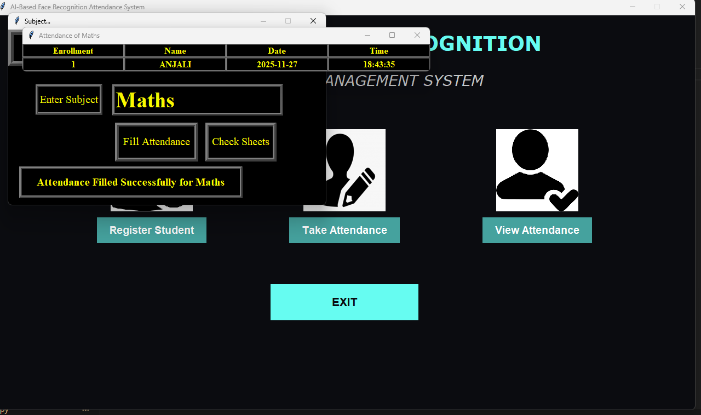

# AI-Based Face Recognition Attendance System

## Overview

AI-Based Face Recognition Attendance System is a desktop application developed using Python, OpenCV, Tkinter, and Pandas. The system automatically identifies registered students through facial recognition and marks attendance digitally, reducing manual effort and preventing proxy attendance.

## Features

* Student registration with face image capture
* Face detection using Haar Cascade Classifier
* Face recognition and automatic attendance marking
* Subject-wise attendance management
* Real-time attendance recording with date and time
* Attendance records stored in CSV format
* Simple and user-friendly graphical interface

## Tech Stack

**Programming Language**

* Python

**Libraries & Tools**

* OpenCV
* Tkinter
* Pandas
* NumPy
* CSV
* Haar Cascade Classifier

## Project Structure

```text
Attendance/
StudentDetails/
TrainingImage/
TrainingImageLabel/
UI_Image/

attendance.py
automaticAttedance.py
show_attendance.py
takeImage.py
takemanually.py
trainImage.py
requirements.txt
README.md
```

## How It Works

1. Register a student by capturing face images.
2. Train the model using the captured images.
3. Enter the subject name.
4. The system recognizes the student's face.
5. Attendance is automatically recorded with:

   * Enrollment Number
   * Student Name
   * Date
   * Time
6. Attendance records are saved in CSV files.

## Screenshots

### Attendance Marked Successfully



## Future Enhancements

* Database integration (MySQL/SQLite)
* Deep Learning based face recognition
* Web-based attendance dashboard
* Cloud attendance storage
* Attendance analytics and reporting

## Author

**Anjali Sharma**

B.Tech Computer Science Engineering (CSE)


